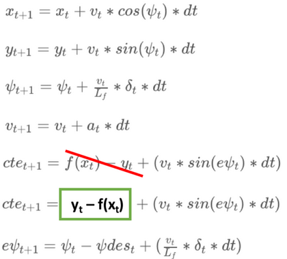
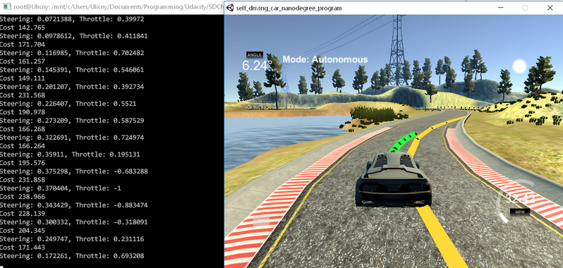

# CarND-Controls-MPC
Self-Driving Car Engineer Nanodegree Program

---

## Dependencies

* cmake >= 3.5
 * All OSes: [click here for installation instructions](https://cmake.org/install/)
* make >= 4.1(mac, linux), 3.81(Windows)
  * Linux: make is installed by default on most Linux distros
  * Mac: [install Xcode command line tools to get make](https://developer.apple.com/xcode/features/)
  * Windows: [Click here for installation instructions](http://gnuwin32.sourceforge.net/packages/make.htm)
* gcc/g++ >= 5.4
  * Linux: gcc / g++ is installed by default on most Linux distros
  * Mac: same deal as make - [install Xcode command line tools]((https://developer.apple.com/xcode/features/)
  * Windows: recommend using [MinGW](http://www.mingw.org/)
* [uWebSockets](https://github.com/uWebSockets/uWebSockets)
  * Run either `install-mac.sh` or `install-ubuntu.sh`.
  * If you install from source, checkout to commit `e94b6e1`, i.e.
    ```
    git clone https://github.com/uWebSockets/uWebSockets
    cd uWebSockets
    git checkout e94b6e1
    ```
    Some function signatures have changed in v0.14.x. See [this PR](https://github.com/udacity/CarND-MPC-Project/pull/3) for more details.

* **Ipopt and CppAD:** Please refer to [this document](https://github.com/udacity/CarND-MPC-Project/blob/master/install_Ipopt_CppAD.md) for installation instructions.
* [Eigen](http://eigen.tuxfamily.org/index.php?title=Main_Page). This is already part of the repo so you shouldn't have to worry about it.
* Simulator. You can download these from the [releases tab](https://github.com/udacity/self-driving-car-sim/releases).
* Not a dependency but read the [DATA.md](./DATA.md) for a description of the data sent back from the simulator.


## Basic Build Instructions

1. Clone this repo.
2. Make a build directory: `mkdir build && cd build`
3. Compile: `cmake .. && make`
4. Run it: `./mpc`.


## Introduction

Goal of this project is to use model predictive control to drive a car around the Udacity simulator lake track.

We are able to control the vehicle with two actuators - steering angle and longitudinal control (accelerating/decelerating, gas/brake). Both of these accept values between -1 and 1. The task is complicated by the fact that the actuators respond with latency of 100 ms.


### The model

In each cycle of the control loop, the simulator provides:

- `ptsx`, `ptsy` - next 6 points on the reference trajectory in global coordinates
- `px`, `py` - position of vehicle in global coordinates
- `psi` - orientation of vehicle with respect to global coordinates
- `v` - speed of the vehicle
- `steering_angle` - current value of steering actuator
- `throttle` - current value of longitudinal control actuator

Since the speed in the simulator is in MPH and our model is in SI units, the speed is converted on line `97`.

To simplify future calculations, the reference waypoints are transformed from global to vehicle coordinate system on lines `102-107`. The results are then stored in `next_x_vals` and `next_y_vals`, which are also used later to display the waypoints as yellow line in simulator.

These points are then converted to `Eigen` library vectors and passed into function `polyfit` on line `123`, which returns coefficients of best fit. I decided to use cubic polynomials, because they were the lowest order, which was able to nicely follow the trajectory even in the tight corners. Let's call this polynomial fit *Polynom(x)*.

On the next lines, I build the current state vector. The 6-dimesional state space is the same as in *Mind the line* - *x* position, *y* position, orientation *psi*, speed *v*, cross-track error *cte* and orientation error *epsi*. 

In the case of 0 latency, the state vector would be simplified, because we are already in the vehicle's frame of reference.

| Variable | Value |
|:---:|:---:|
|  x  |  0  |
|y|0|
|psi|0|
|v|v|
|cte| Polynom(0) = const. coeff. |
|epsi|  -atan(*d*Polynom/*dx*(0)) = -atan(lin. coeff.) |

But since there is 100 ms latency, we need to project the current state 100 ms into the future, because that is when the actuators will apply our commands.

We will use the following motion update equations to do that (these are updated equations based on [comment](https://carnd.slack.com/files/U5D4X9W20/F87DLPJ5Q/mpc_motion_equation_correction.png) from user *Effendi* in project Slack channel ):


| Variable | Value |
|:---:|:---:|
|  x  |  v*latency  |
|y|0|
|psi| - v * latency * steering_angle/Lf |
|v| v + throttle * latency |
|cte| - const. coeff. + v * latency * sin(-atan(lin. coeff.)) |
|epsi| -atan(lin. coeff.) - v * latency * steering_angle/Lf |

, where *Lf* is the length from front to CoG of the car.

In the next step, we call the MPC method `Solve`. This method finds the optimal solution for state variables and actuators to fit the waypoints given some constraints and bounds.

First, we need to decide how long and with what granularity we want to predict the motion. Before starting this project, I watched the Udacity Google Hangout for this project, where recommanded values were to look *N* = 10 steps of *dt* = 0.1 s into the future. I decided to follow this (Later I did some experimenting and found out that you can't predict much more, because when the car is going fast, the prediction might go past the available waypoints and the whole solution then doesn't make sense.).

The heavy-lifting is done by IPOPT on line `259` in  `MPC.cpp`, which returns the solution to our problem. We just need to specify the problem:

- **vars** the values we are trying to find - state variables and actuators
- **vars bounds** the state variables can be whichever value, absolute steering angle is limited to 25° and the longitudinal actuator must be between -1 and 1
- **constraints** obviously we can't change the initial state and we also need to respect our motion model for updates of state variables between every timestep
- **objective** this is variable that the solver will try to minimize. The probably most important and difficult part of this project is to choose suitable cost function for the solver.

I used following terms in my cost function:

- quadratic penalty for being far from the referance trajectory
- quadratic penalty for having different orientation than on reference trajectory
- penalty for low speed - exponential decrease of penalty with speed
- quadratic penalties for using steering or longitudinal control
- quadratic penalties for changing angle of steering or longitudinal control

Every of these terms is weighted and manual tuning of these weights were the most time consuming part of the project.

The final set of weights:

Penalty | Weight
--- | :---:
CTE | 30
orientation | 20
speed | 10
steering | 1
long. ctrl | 0.1
change of steering | 1000000
change of long. ctrl | 1000


The `Solve` method returns vector with next values for steering and longitudinal control on the first two positions, which are followed by x and y coordinates of predicted path.

This result is then used to send commands to the simulator to control the vehicle and to display the predicted path.


## Development diary

This is quick summary of my path to the latest version described above:

1. Repurpose the code from the lesson project *Mind the line*.
2. Corrected the psi orientation.
3. Reduced the cost terms to just CTE
4. Noticed that waypoints were being fitted by just two coeff, so line --> go quadratic
5. Bad performance with oscillations, caused by the latency
6. Reduced latency to 0 to gradually build up the project
7. Bad behaviour in turns, mostly after passiing waypoint --> suspecting change in polynom
8. Plot the polynom instead of raw waypoints 
9. Confirmed --> go cubic
10. Much better, still some crazy predicted paths in sharp turns, but car drives around the track
11. Tried increasing reference speed to 100
12. Yeah, noooo. let's try 60.
15. Corners are not good + osccilations
17. Noticed I forgot to update the constraints after changing the polynom from linear to cubic
18. Car is not braking hard enough into turns, tries to keep reference speed --> leaves track
19. Instead of refernece speed, new exponential penalty for low speeds
22. Incorporated the motion update tip from Effendi from Slack - improvement in oscillations
24. Tuning weights --> success. Vehicle drives around quite nicely.
25. Add latency --> Just terrible.
26. Predict the initial state. 
27. Reset all weights and tune again.
28. Noticed I deleted the initial terms for x, y, psi from bounds and constraints, because they were not needed without latency.
29. Retune weights.
30. Vehicle drives confidently around the track even with latency.


## Conclusion

My MPC program is able to reliably drive the car around the track.



Questions:

- Why do the waypoints change when the car becomes unstable? Shouldn't they be independant on the frame of referance? 

Ideas for improvement:

- the car slowly oscillates arount the reference trajectory. This is mostly apparent on straights. I couldn't increase the penalty for changing the steering more,  because otherwise the car couldn't steer fast enough in turns. Also, I am quite convinced that this is connected to the previous questions, because I can see the reference trajectory wiggle around in opposite manner to the predicted path. I suspect that this is the root cause of these oscillations.
- automatic way to tune the weights. Score the parameter set after driving one full lap.

